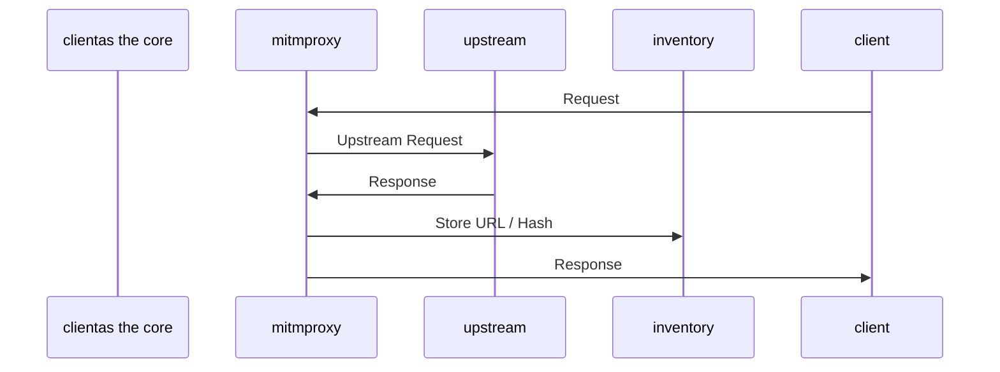
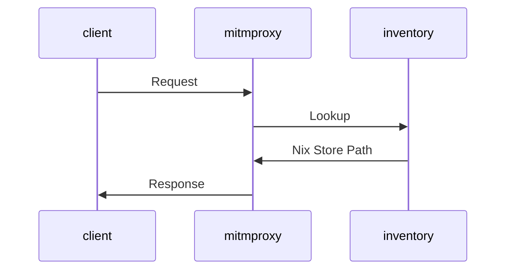

# Nix Buildproxy

Providing reproducible HTTP/HTTPS responders to builds that just can not live without.

## Motivation

When building Nix packages in the sandbox, internet access is usually not available. However, some packages insist on loading content from the internet. The motivation to build this tool came from a CMake build that loaded additional cmake-files that, in turn, would trigger further package downloads.

Unwilling to go through multi-level patching during the build, I wondered if it's possible to capture, nixify, and later serve HTTP/HTTPS requests from the Nix store to create an escape hatch when the proper solution is just too much effort. Turns out, this is possible, with some caveats.

## Usage

A quick example on how this package works with the included `example/evil_build.sh` example.

### Overlay

The flake provides an overlay that will make the `buildproxy-capture` package available as well as extend `lib` to contain `lib.mkBuildproxy`. It is recommended to use this overlay. For example, when importing `nixpkgs` in a flake, the overlay is applied as follows:

```nix
{
    inputs = {
        nixpkgs.url = "github:NixOS/nixpkgs/nixos-unstable";
        nix-buildproxy.url = "github:polygon/nix-buildproxy";
    };

    outputs = inputs@{ self, nixpkgs, nix-buildproxy, ... }:
    let
        system = "x64_64-linux";
        pkgs = import nixpkgs {
            inherit system;
            overlays = [ nix-buildproxy.overlays.default ];
        };
    in
    {
        ...
    }
}
```

### Capturing requests

Before starting to bring in `nix-buildproxy`, you should be able to build your project (e.g. in a devShell) and downloads during the build are preventing a proper sandboxed nix build. Run `buildproxy-capture` by either adding the `buildproxy-capture` program to your environment or directly through `nix run github:polygon/nix-buildproxy#buildproxy-capture`. This will launch `mitmproxy` and a subshell that has `HTTPS_PROXY` and `HTTP_PROXY` set. This is fine for CMake, since it respects these variables and does not check certificates. Other build systems might require more convincing.

Then, run your build and exit the subshell when done. This will generate a `proxy_content.nix` file with all the requests.

<details>
<summary>Here is how the session might look like:</summary>

```bash
nixbrett ➜ nix/nix-buildproxy/example (main ✗) buildproxy-capture
Entering proxy capture shell, run your build now, exit shell when done
nixbrett ➜ nix/nix-buildproxy/example (main ✗) ./evil_build.sh
  % Total    % Received % Xferd  Average Speed   Time    Time     Time  Current
                                 Dload  Upload   Total   Spent    Left  Speed
100  1237  100  1237    0     0   2811      0 --:--:-- --:--:-- --:--:--  2817
  % Total    % Received % Xferd  Average Speed   Time    Time     Time  Current
                                 Dload  Upload   Total   Spent    Left  Speed
100   165  100   165    0     0    553      0 --:--:-- --:--:-- --:--:--   551
nixbrett ➜ nix/nix-buildproxy/example (main ✗) <Ctrl+D>
Saving captured requests to proxy_content.nix
nixbrett ➜ nix/nix-buildproxy/example (main ✗) cat proxy_content.nix
{ fetchurl }: [
  {
    url = "https://raw.githubusercontent.com/NixOS/nixpkgs/ba563a6ec1cd6b3b82ecb7787f9ea2cb4b536a1e/pkgs/by-name/he/hello/package.nix";
    file = fetchurl {
      url = "https://raw.githubusercontent.com/NixOS/nixpkgs/ba563a6ec1cd6b3b82ecb7787f9ea2cb4b536a1e/pkgs/by-name/he/hello/package.nix";
      hash = "sha256-dFkeANLBJW1FWfL0d8ciS4siWP7B4z0vGsj9revgWGw=";
    };
  }
  {
    url = "https://raw.githubusercontent.com/NixOS/nixpkgs/ba563a6ec1cd6b3b82ecb7787f9ea2cb4b536a1e/pkgs/by-name/he/hello/test.nix";
    file = fetchurl {
      url = "https://raw.githubusercontent.com/NixOS/nixpkgs/ba563a6ec1cd6b3b82ecb7787f9ea2cb4b536a1e/pkgs/by-name/he/hello/test.nix";
      hash = "sha256-fg+tJQ4+U2G/9lqvOnakIJ2VBgKJoteewT2LHUV6sP4=";
    };
  }
]
```
</details>

### Replaying responses
In order to reply to responses, you need to create a buildproxy recipe that serves your `proxy_content.nix`. You can use `lib.mkBuildproxy <path-to-proxy_content.nix>` for this. To enable the buildproxy in your build, run `source ${buildproxy}` early in your build (before any downloads are attempted, `prePatch` is a good candidate). This will start `mitmproxy` in replay mode and set the `HTTP_PROXY` and `HTTPS_PROXY` variables. A basic scaffold:

```nix
{ stdenv, lib, ... }:
let
  buildproxy = lib.mkBuildproxy ./proxy_content.nix;
in
stdenv.mkDerivation {
    # ...
    prePatch = ''
      source ${buildproxy}
    '';
    # ...
}
```

## How it works

`nix-buildproxy` uses [mitmproxy](https://mitmproxy.org/) under the hood to do the heavy lifting of providing local proxy functionality. Python addons are used to intercept requests and will either create the proxy content library or serve it. Building the proxy content library works as follows:



During replay, operation looks like this:



## Compatibility / Challenges

This package was originally built for and works out of the box with CMake. CMake respects the `HTTP_PROXY/HTTPS_PROXY` environment variables and by default ignores certificate errors. If you are using a different tool, you need to figure out how to configure the proxy server and how to tell the tool to accept the self-signed certificate of `mitmproxy`.

`mitmproxy` will load responses full into memory, I have not yet found out if streaming from/to disk is possible. If this is being used to serve large files, expect RAM usage of at least the file size, possibly several times that.

HTTP redirects are currently not properly handled. The resulting `proxy_content.nix` will contain the original request with a hash for an empty response and the redirected request with the actual hash separately. You can fix this issue by copying the final `sha256` to the entry that redirects to it. This will be properly addressed in a future update.

You can modify `proxy_content.nix` to deliver different files. To make builds more stable, it is recommended to replace requests to, e.g., the moving `main` branch of a project to a concrete commit hash. Otherwise, future builds might experience checksum failures. This can also be used as an effective patching mechanism but there is currently no support built in.

## Open issues / Roadmap

* [ ] Properly handle HTTP redirects: Undecided whether to replay the redirect or whether to deliver the resulting file immediately, the latter breaking in case the client modifies the request
* [ ] Properly handle non-success HTTP status codes in general
* [ ] Add framework for patching of downloaded files
