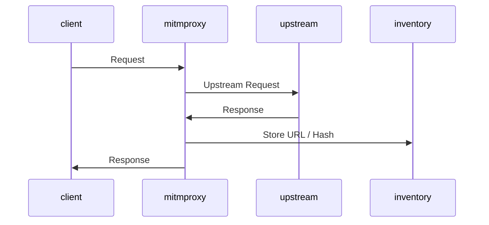
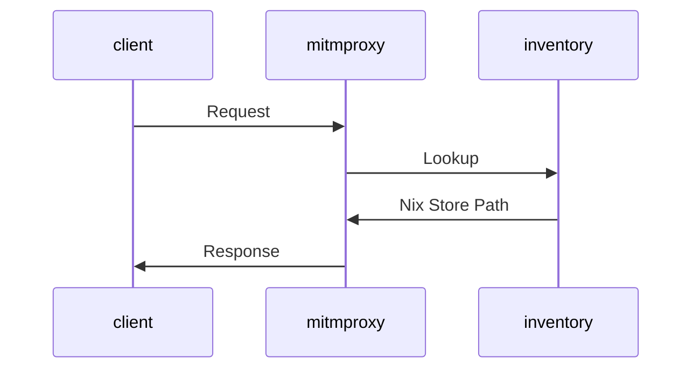

# Nix Buildproxy

Providing reproducible HTTP/HTTPS responders to builds that just can not live without.

## Introduction

```mermaid
sequenceDiagram
    participant client
    participant mitmproxy
    participant upstream
    participant inventory
    client->>mitmproxy: Request
    mitmproxy->>upstream: Upstream Request
    upstream->>mitmproxy: Response
    mitmproxy->>inventory: Store URL / Hash
    mitmproxy->>client: Response
```

```mermaid
sequenceDiagram
    participant client
    participant mitmproxy
    participant inventory
    client->>mitmproxy: Request
    mitmproxy->>inventory: Lookup
    inventory->>mitmproxy: Nix Store Path
    mitmproxy->>client: Response
```
